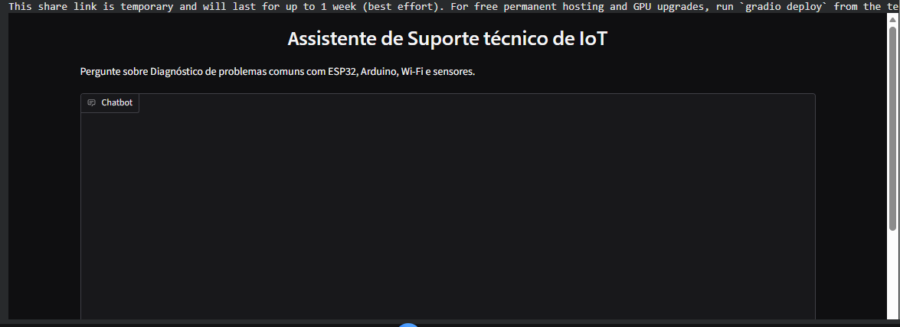

# Avaliação IA Generativa: <nome do tema>

## Integrantes
- Gabriel Cabral Mendes Mariano (RM563230)

## Tema
Suporte técnico de IoT

## System prompt usado
SYSTEM_PROMPT = """Você é um assistente de Suporte técnico de IoT.
Ajude o usuário com dúvidas sobre diagnóstico de problemas comuns com ESP32, Arduino, Wi-Fi e sensores.
Responda sempre em português, de forma clara, em no máximo 5 frases.
Se a pergunta não tiver relação com suporte técnico de IoT, diga educadamente que não pode ajudar."""

## Etapas realizadas
- [ ] Etapa 1: Assistente com guardrails
- [ ] Etapa 2: Comparação com temperatura
- [ ] Etapa 3: Chat com memória e troca de modelo
- [ ] Etapa 4: Interface Gradio com temperatura
- [ ] Etapa 5 (bônus): API com sessões independentes

## Interface

